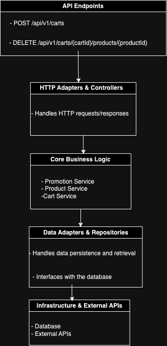

# Shopping Cart & Promotions API

## Questions

### 1. How long did you spend on the test? What would you add if you had more time?

I spent approximately 20 to 25 hours during the night working on the test. If I had more time, I would increase the test coverage, especially for functionalities related to the shopping cart.


### 2. What was the most useful feature that was added to the latest version of your chosen language? Please include a snippet of code that
   shows how you've used it.

One of the most useful features added in Java 21 is ***virtual threads***. These allow for lightweight threads that can improve scalability, especially for I/O-heavy applications like web services. Here's an example of how I used virtual threads to handle concurrent requests:

For versions after spring boot 3.2
```bash
spring.threads.virtual.enabled=true
```

### 3. What did you find most difficult?

The most difficult aspect was finding time to work on the test during the week, as I was quite busy with my current job.

### 4. What mechanism did you put in place to track down issues in production on this code? If you didn’t put anything, write down what you
   could do.

One effective mechanism to track down issues in production is implementing centralized logging using Spring Boot with Logback or ELK (Elasticsearch, Logstash, Kibana) stack. This allows me to monitor application logs in real time and filter by error levels or specific contexts. Additionally, integrating Prometheus for metrics collection and Grafana for visualization would help track application performance and identify potential bottlenecks.

*Note*: The record that represents a promotion coming from the API has an enum promotion type, I ended up forgetting that we should receive several types of promotions in the future, so if I had more time, I would also solve that.
### 5. The Wiremock represents one source of information. We should be prepared to integrate with more sources. List the steps that we would
   need to take to add more sources of items with diferent formats and promotions.

To integrate additional sources of items with different formats and promotions into the API, we can follow these steps:

Abstraction: Introduce an abstraction (e.g., an interface) for external data sources. This will allow the API to easily accommodate new sources by following a common contract.
New Client Implementations: Implement new clients for each external source (e.g., using Feign, RestTemplate, or WebClient).
Data Transformation: Add mappers to convert the different formats from the new sources into the system’s internal format.
Promotion Handling: Ensure that promotions from different sources are normalized into a unified structure so they can be consistently applied.
Testing: Use Wiremock or similar tools to mock the behavior of the new sources and run integration tests to validate the handling of items and promotions from different sources.

## Swagger
This project contains a swagger, after starting the project you can see the swagger.
```bash
http://localhost:8080/swagger-ui/index.html#
```

## Diagram



## Description
This API allows managing operations related to promotions, products, and the shopping cart. Through it, you can create and update promotions, manage the cart's contents, and view available products.

## Endpoints

### Promotions
Operations related to promotions.

- **Create Promotion**  
  `POST /api/v1/promotions`  
  Creates a new promotion.

- **Get Promotion by ID**  
  `GET /api/v1/promotions/{promotionId}`  
  Returns the details of a specific promotion by its ID.

- **Update Promotion**  
  `PATCH /api/v1/promotions/{promotionId}`  
  Updates an existing promotion.

### Cart
Operations related to the shopping cart.

- **Get Cart by ID**  
  `GET /api/v1/carts/{cartId}`  
  Returns the contents of a specific shopping cart.

- **Update Cart**  
  `PUT /api/v1/carts/{cartId}`  
  Updates a shopping cart, allowing products to be added or modified.

- **Create Cart**  
  `POST /api/v1/carts`  
  Creates a new shopping cart.

- **Remove Product from Cart**  
  `DELETE /api/v1/carts/{cartId}/products/{productId}`  
  Removes a specific product from the cart.

### Products
Operations related to products.

- **List Products**  
  `GET /api/v1/products`  
  Returns a list of all available products.

- **Get Product by ID**  
  `GET /api/v1/products/{productId}`  
  Returns the details of a specific product by its ID.

## Installation
1. Clone the repository:
   ```bash
   git clone https://github.com/example/api-shopping-cart.git
2. After run the wiremock, run this command to start:
   ```bash
   ./gradlew bootRun
